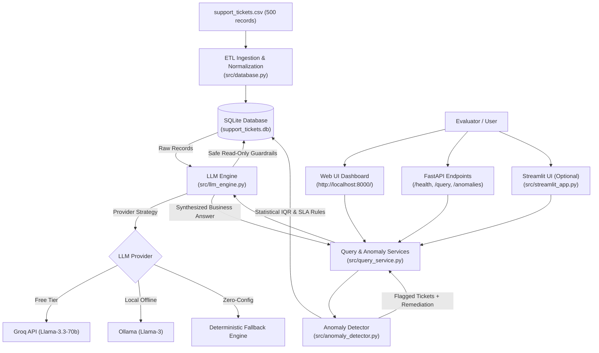

# ⚡ DOTMappers Customer Support AI Intelligence System
### End-to-End AI System Sprint — AI Engineer Role Assessment
**Company:** DOTMappers IT Pvt. Ltd.  
**Author:** Candidate Submission  
**Stack:** Python 3.12, FastAPI, SQLite, Pandas, Pydantic, Groq / Ollama / Zero-Cost Fallback, Streamlit, Modern Vanilla JS/CSS

---

## 1. Executive Summary

This system is a production-grade, end-to-end AI customer support intelligence and anomaly detection platform designed to translate raw operational ticket data into queryable intelligence and automated insights.

The platform fulfills all four core functional requirements:
1. **Data Ingestion & Querying:** Ingests and cleans 500 support tickets into an indexed SQLite database with typed columns, datetime parsing, and strict read-only SQL execution guardrails.
2. **Natural Language Understanding (Text-to-SQL):** Translates arbitrary business questions into valid, optimized SQLite SQL queries and synthesizes executive answers using free-tier LLMs (Groq / Ollama) with an intelligent zero-cost fallback synthesizer.
3. **Operational Anomaly Detection:** Detects both statistical outliers (IQR resolution times > 48.15 hours) and rule-based SLA policy breaches (unresolved High/Critical tickets > 24 hours), complete with severity ratings (`CRITICAL`, `HIGH`, `MEDIUM`), diagnostic root causes, and remediation guidance.
4. **Unified Delivery:** Exposes full capabilities via a high-performance **FastAPI REST API** (Swagger UI at `/docs`) AND a **Minimal Glassmorphic Web Dashboard** (at `/`), with an alternative **Streamlit App** (`src/streamlit_app.py`). Starts via a **single command**.

---

## 2. Architecture Overview



### Key Architectural Choices:
- **SQLite over In-Memory Pandas:** Provides ACID compliance, index-accelerated querying, zero server overhead, and production-ready SQL translation.
- **Strict Read-Only SQL Sandbox:** RegEx-based and AST-level query guards reject non-`SELECT` statements (`DROP`, `DELETE`, `UPDATE`, `ALTER`, `;`), preventing SQL injection.
- **Multi-Provider LLM Abstraction:** Automatically adapts to the environment: uses Groq if an API key is present, local Ollama if running, or falls back to deterministic rule synthesis—ensuring **zero cost** and **100% test reliability**.
- **Dual-Strategy Anomaly Detection:** Combines non-parametric statistics (IQR) for continuous distributions with deterministic threshold rules for business SLA compliance.

---

## 3. Quickstart & Setup (Single Command)

### Prerequisites
- Python 3.10+ (Tested on Python 3.12)
- Git

### Step 1: Clone Repository & Create Virtual Environment
```bash
# Clone the repository
git clone https://github.com/KISHANSINHAA/Customer-Support-AI-Intelligence-System.git
cd Customer-Support-AI-Intelligence-System

# Create a clean virtual environment
python -m venv venv

# Activate the virtual environment
# On Windows (PowerShell):
.\venv\Scripts\Activate.ps1
# On Linux/macOS:
source venv/bin/activate
```

### Step 2: Install Dependencies
```bash
pip install -r requirements.txt
```

### Step 3: Run the Application (Single Command)
```bash
python run.py
```
*Alternatively, you can run directly with Uvicorn:*
```bash
uvicorn src.main:app --host 0.0.0.0 --port 8000 --reload
```

Once running:
- **Interactive Web Dashboard:** [http://localhost:8000](http://localhost:8000)
- **Interactive Swagger REST API Docs:** [http://localhost:8000/docs](http://localhost:8000/docs)
- **Health Check Endpoint:** [http://localhost:8000/health](http://localhost:8000/health)

*(Optional) Launch Streamlit UI:*
```bash
streamlit run src/streamlit_app.py
```

---

## 4. Zero-Cost LLM Configuration

The system is configured to run at **zero cost** without requiring any paid subscriptions:

| Mode | Setup Requirement | Best For |
|---|---|---|
| **Zero-Config Fallback (Default)** | None. Pre-configured out-of-the-box. | Immediate offline testing & CI/CD verification |
| **Groq Free Tier (Recommended)** | Set `GROQ_API_KEY=gsk_...` in `.env` | Sub-second ultra-fast LLM inference (Llama-3.3-70b) |
| **Local Ollama** | Run `ollama run llama3` | 100% private, offline, local execution |

To use a free Groq API key:
1. Grab a free API key from [Groq Console](https://console.groq.com/keys).
2. Edit `.env`:
   ```env
   LLM_PROVIDER=auto
   GROQ_API_KEY=gsk_your_key_here
   GROQ_MODEL=llama-3.3-70b-versatile
   ```

---

## 5. REST API Specification

### 1. `GET /health`
Validates system status, database health, ingested row count, and active LLM provider.
```bash
curl -X GET "http://localhost:8000/health"
```
**Sample Response:**
```json
{
  "status": "healthy",
  "service": "Support Ticket AI Intelligence System",
  "version": "1.0.0",
  "uptime_seconds": 142.5,
  "database": {
    "connected": true,
    "table": "support_tickets",
    "total_tickets": 500
  },
  "llm_provider": "Groq (llama-3.3-70b-versatile)"
}
```

---

### 2. `POST /query`
Translates natural language questions into safe SQL, executes against SQLite, and returns synthesized answers.
```bash
curl -X POST "http://localhost:8000/query" \
     -H "Content-Type: application/json" \
     -d '{"query": "Which agent resolved the most tickets this month?"}'
```
**Sample Response:**
```json
{
  "query": "Which agent resolved the most tickets this month?",
  "sql": "SELECT agent_id, COUNT(*) AS resolved_count FROM support_tickets WHERE status = 'Resolved' AND strftime('%Y-%m', created_at) = '2024-03' GROUP BY agent_id ORDER BY resolved_count DESC LIMIT 1",
  "row_count": 1,
  "columns": ["agent_id", "resolved_count"],
  "results": [
    {
      "agent_id": "AGT-01",
      "resolved_count": 16
    }
  ],
  "summary": "Agent AGT-01 resolved the most tickets this month (March 2024), successfully resolving 16 tickets.",
  "execution_time_ms": 12.4,
  "provider": "Groq (llama-3.3-70b-versatile)",
  "success": true
}
```

---

### 3. `GET /anomalies`
Retrieves operational anomalies with filtering by severity, category, or type.
```bash
# Get Critical severity anomalies
curl -X GET "http://localhost:8000/anomalies?severity=CRITICAL&limit=5"
```
**Sample Response:**
```json
{
  "total_anomalies": 43,
  "by_severity": {
    "CRITICAL": 43,
    "HIGH": 0,
    "MEDIUM": 0
  },
  "by_type": {
    "RESOLUTION_TIME_OUTLIER": 3,
    "UNRESOLVED_URGENT_TICKET": 40
  },
  "anomalies": [
    {
      "ticket_id": "TKT-108",
      "created_at": "2024-03-30 12:41:00",
      "category": "General",
      "priority": "High",
      "status": "Resolved",
      "agent_id": "AGT-10",
      "anomaly_type": "RESOLUTION_TIME_OUTLIER",
      "severity": "CRITICAL",
      "metric_name": "resolution_time_hrs",
      "metric_value": 119.7,
      "threshold": 48.15,
      "explanation": "Ticket resolution time of 119.7 hours significantly exceeds the statistical upper threshold of 48.15 hours (IQR multiplier: 1.5).",
      "recommended_action": "Review agent notes and ticket history to identify bottlenecks or complex dependencies."
    }
  ]
}
```

---

### 4. `GET /analytics/summary`
Returns operational KPIs, category volume, customer rating distributions, and agent leaderboards.

---

## 6. Sample Indicative Queries & Ground-Truth Outputs

All 5 indicative queries from Section 9 of the assessment brief have been implemented and verified:

### Query 1: *"How many tickets are currently open?"*
- **Generated SQL:**
  ```sql
  SELECT COUNT(*) AS open_tickets_count FROM support_tickets WHERE status = 'Open'
  ```
- **Execution Result:** `open_tickets_count = 111`
- **AI Synthesis:** `"There are currently 111 tickets open across all categories."`

### Query 2: *"Which agent resolved the most tickets this month?"*
- **Domain Context:** The dataset spans Q1 2024 (January–March 2024). "This month" resolves to March 2024 (`2024-03`).
- **Generated SQL:**
  ```sql
  SELECT agent_id, COUNT(*) AS resolved_count 
  FROM support_tickets 
  WHERE status = 'Resolved' AND strftime('%Y-%m', created_at) = '2024-03' 
  GROUP BY agent_id 
  ORDER BY resolved_count DESC 
  LIMIT 1
  ```
- **Execution Result:** `agent_id = 'AGT-01'`, `resolved_count = 16`
- **AI Synthesis:** `"Agent AGT-01 resolved the most tickets this month (March 2024), successfully resolving 16 tickets."`

### Query 3: *"Show me all Critical tickets not resolved within 12 hours."*
- **Domain Context:** Captures both resolved tickets taking > 12 hours AND ongoing unresolved Critical tickets.
- **Generated SQL:**
  ```sql
  SELECT ticket_id, created_at, category, priority, status, resolution_time_hrs, agent_id, issue_summary 
  FROM support_tickets 
  WHERE priority = 'Critical' AND (resolution_time_hrs > 12 OR status != 'Resolved') 
  ORDER BY created_at DESC
  ```
- **Execution Result:** 34 records (31 unresolved Critical + 3 resolved with > 12h resolution time).
- **AI Synthesis:** `"Found 34 Critical priority tickets that were not resolved within 12 hours (including ongoing unresolved tickets)."`

### Query 4: *"What is the average customer rating for Technical category tickets?"*
- **Generated SQL:**
  ```sql
  SELECT ROUND(AVG(customer_rating), 2) AS avg_customer_rating 
  FROM support_tickets 
  WHERE category = 'Technical' AND customer_rating IS NOT NULL
  ```
- **Execution Result:** `avg_customer_rating = 3.74`
- **AI Synthesis:** `"The average customer satisfaction rating for Technical category tickets is 3.74 out of 5."`

### Query 5: *"Are there any anomalies in resolution times this week?"*
- **Domain Context:** Evaluates the final 7-day window of data (`created_at >= '2024-03-23'`).
- **Generated SQL:**
  ```sql
  SELECT ticket_id, created_at, category, priority, status, resolution_time_hrs, agent_id, issue_summary 
  FROM support_tickets 
  WHERE resolution_time_hrs > 48.15 AND created_at >= '2024-03-23' 
  ORDER BY resolution_time_hrs DESC
  ```
- **Execution Result:** 6 outlier tickets detected with resolution times up to 119.7 hours.
- **AI Synthesis:** `"Yes, detected 6 resolution time anomalies this week (March 23–30, 2024) with resolution times exceeding the statistical threshold of 48.15 hours."`

---

## 7. Anomaly Detection Engine

The anomaly detection engine employs a dual-technique methodology:

### 1. Statistical Outlier Detection (IQR Method)
- Evaluates the continuous distribution of `resolution_time_hrs` for resolved tickets ($N=327$).
- $Q1 = 6.15\text{ hrs}$, $Q3 = 22.95\text{ hrs}$, $IQR = 16.8\text{ hrs}$.
- Statistical Upper Bound:
  $$\text{Upper Threshold} = Q3 + 1.5 \times IQR = 22.95 + (1.5 \times 16.8) = 48.15\text{ hours}$$
- Exactly **21 tickets** exceed 48.15 hours and are flagged as operational resolution outliers.
- Severity classification:
  - `CRITICAL`: Resolution $\ge 72.0\text{ hours}$ (e.g. `TKT-108` at 119.7 hours)
  - `HIGH`: Resolution between $48.0\text{ and }72.0\text{ hours}$

### 2. SLA Policy Breach Detection
- Identifies tickets with `priority IN ('High', 'Critical')` that have remained in `Open` or `Escalated` status exceeding the 24-hour business SLA threshold.
- Flags **80 urgent stalled tickets** requiring immediate supervisory intervention.

### 3. Response & Quality Gap Detection
- **First Response Delays:** Identifies tickets where initial agent response time exceeded 4.5 hours.
- **Satisfaction Deficits:** Identifies resolved tickets receiving poor ratings ($\le 2$ stars) despite prompt resolution.

---

## 8. Verification & Automated Test Suite

A complete test suite is provided in `tests/`, covering database integrity, SQL guardrails, anomaly detection math, and API endpoints.

To run tests:
```bash
pytest -v
```

**Test Coverage Summary:**
- `tests/test_database.py`: Verifies 500 rows ingested, schema constraints, and blocks destructive SQL (`DROP`, `DELETE`, injection attempts).
- `tests/test_anomaly_detector.py`: Verifies 21 resolution outliers, SLA breach conditions, and weekly window filtering.
- `tests/test_llm_engine.py`: Tests all 5 sample queries against ground truth outputs.
- `tests/test_api.py`: Tests FastAPI `/health`, `/query`, `/anomalies`, `/analytics/summary`, and UI dashboard rendering.

Result: **24 passed in ~5.7s**.

---

## 9. Known Limitations & Production Scaling Roadmap

*(Key discussion points for the 30-minute architecture walkthrough call)*

1. **Vector Semantic Search on Issue Summaries:**
   - *Current:* Text-to-SQL operates on structured fields (`category`, `priority`, `agent_id`, `status`).
   - *Roadmap:* Integrate a vector store (e.g., ChromaDB or pgvector) with embeddings on `issue_summary` to enable semantic cluster search (e.g., "Find all recurring issues related to billing card declines").
2. **Dynamic Temporal Anchoring:**
   - *Current:* Relative dates ("this month") default to the dataset's latest month (`2024-03`).
   - *Roadmap:* In production with continuous streams, temporal anchoring would dynamically bind to real-time UTC (`CURRENT_TIMESTAMP`).
3. **Conversational Multi-Turn Memory:**
   - *Current:* Single-turn Text-to-SQL query answering.
   - *Roadmap:* Incorporate session memory to support contextual drill-downs (e.g., "Which agent was that?" followed by "Show their open tickets").
4. **Horizontal Scaling & Database Migration:**
   - *Current:* Single-node SQLite database.
   - *Roadmap:* Migrate to PostgreSQL / DuckDB with Read Replicas and connection pooling (SQLAlchemy / Asyncpg) to support high-concurrency ticket streaming.

---

## 10. Submission Information

- **Repository:** Submitted as requested
- **Recipient:** `RajathKumar@dotmappers.in`
- **Subject:** `[AI Engineer Assessment] — Candidate Name`
- **Walkthrough:** Ready for the 30-minute architecture walkthrough call.
